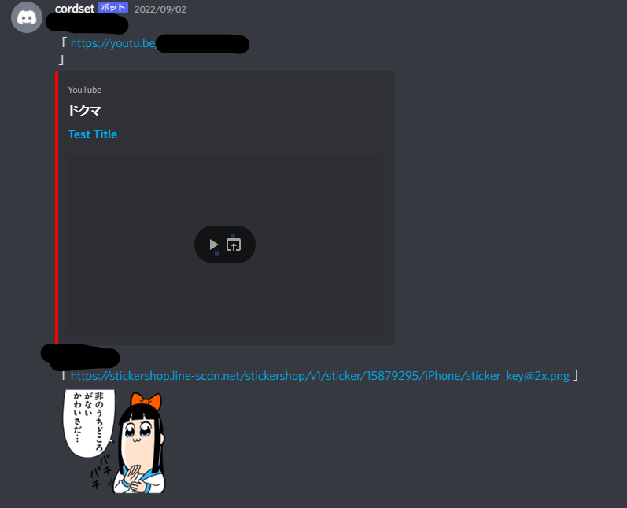
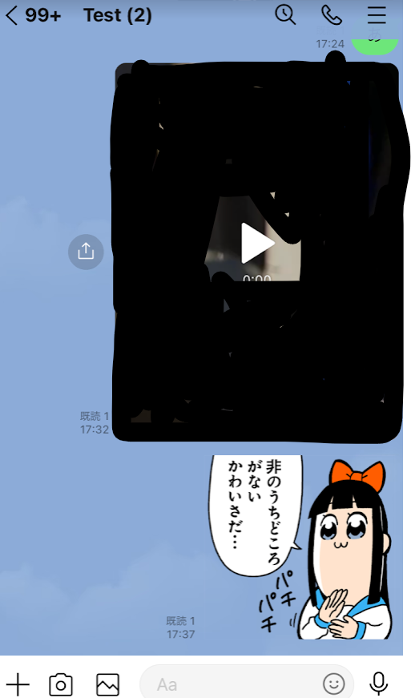
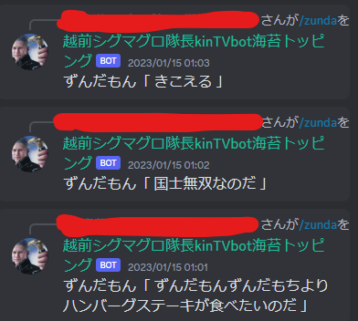
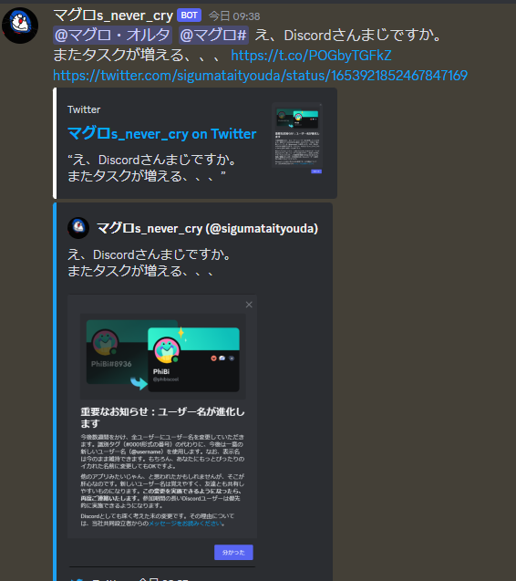
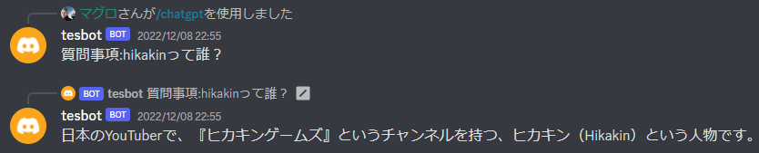
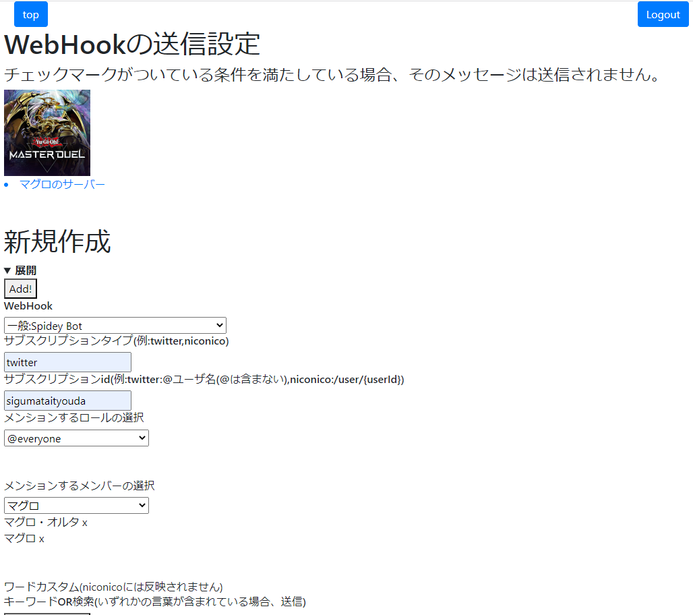

# これは何？？
Discordの多機能Botです。
# 機能は？
- LINEとのメッセージ連携
- ボイスチャンネルの入退室通知
- Web版VOICEVOXによる読み上げ機能
- カラオケ(動作不安定)
- ~~ChatGPTへの質問~~(現在使用不可)
- ~~Twitter~~,niconico,YouTubeの通知
- PostgreSQLを使用したLINEと入退室の管理

# ボイスチャンネルの入退室通知


#### 画面共有  


# LINEとのメッセージ共有
     

LINE側でメンションも可能です。

```
/チャンネル名#channel
    メッセージの先頭につけることで、送信先のチャンネルを指定できる。
@Discordのユーザー名#4桁の数字#member
    Discordのユーザーにメンションが可能。(ニックネームはNG)
@ロール名#role
    ロールでメンションが可能。
```
    

動画、スタンプも共有可能です。  
   

複数のサーバーにそれぞれLINEグループを作成し、それぞれにメッセージを共有させることもできます。
環境変数の項目で詳しく説明します。

# カラオケ
**注意:YouTube-dlを使用しています。**
```
/download
    YouTubeから音源をダウンロードします。
/start_record
    ダウンロードした音源を再生し、同時に録音を行います。
/rank_scoring
    音源と録音した音声を比較し、100点満点で採点します。
```


# Web版VoiceVoxのよる読み上げ機能
```
/zunda
	Botがボイスチャンネルに入室し、VoiceVoxでしゃべります。
/stop_zunda
	Botをボイスチャンネルから切断します。
```


# WebHookの投稿機能


# chatgtp(使用不可)
AIに質問できます。API更新前なので現在使用できるかわかりません。
```
/chatgtp
    AIに質問できます。
```


# Postgresqlを使用したカスタマイズ機能


# 使い方
本botはrailwayというサービスでのホストを想定しています。  
Dockerを使用しているので、簡単にホストできます。  
[](https://railway.app/new/template/JXslR5?referralCode=yFsnKR)  
railway側でLINEとDiscordBotをホストできるようにしています。  

## 使用するサービス  
以下のAPI、サービスを使用します。  
|[](https://developers.line.biz/console/?status=success)|[](https://discord.com/developers/docs/resources/webhook)|[](https://developers.google.com/youtube/v3/getting-started?hl=ja)|[](https://voicevox.su-shiki.com/su-shikiapis/)|[](https://notify-bot.line.me/my/services/new)|
|---|---|---|---|---|
|[LINE Developers](https://developers.line.biz/console/?status=success)|[Discord Webhook](https://discord.com/developers/docs/resources/webhook)|[YouTube Date API](https://developers.google.com/youtube/v3/getting-started?hl=ja)|[Web版Voicevox](https://voicevox.su-shiki.com/su-shikiapis/)|[LINE Notify](https://notify-bot.line.me/my/services/new)|
|[参考](https://qiita.com/taka777n/items/c601421b871fd2b6a55f)|[参考](https://qiita.com/iroha71/items/b2a473898d6c9b4b4ae7)|[参考](https://qiita.com/koki_develop/items/4cd7de3898dae2c33f20)|  

LINEは画像や動画のファイルがバイナリデータとして渡され、一定時間で削除されてしまうので動画はYouTubeにアップロードしてDiscordに送ります。  
YouTube APIは参考リンクをもとに、試しに動画をアップロードしておいてください。そうすると2つのjsonファイルが生成されるので控えておいてください。  
``` 控えておくjson
client_secret{clientのid}.json
upload_video.py-oauth2.json
```

# 環境変数について

DiscordBotのトークン以外にも、登録するものが大量にあります。
すべて```.env.sample```に記載されています。

<details>
	<summary>PORT=8080</summary>

```bash
・ポート番号。railwayでfastapiを立ち上げるのに必須（と公式で推奨されている）。
デフォルトで8080
```

</details>

<details>
	<summary>DISCORD_CALLBACK_URL</summary>

```bash
・Discordログインの認証時に遷移するURL。
Developサイトにも同様に登録しておくこと。
```

</details>

<details>
	<summary>DISCORD_CLIENT_ID</summary>

```bash
DiscordアプリのID。
BotのユーザIDと同じ。
```

</details>

<details>
	<summary>DISCORD_CLIENT_SECRET</summary>

```bash
Discordのシークレットキー
認証時に使用する。Developサイトから発行すること。
```

</details>

<details>
	<summary>DISCORD_SCOPE</summary>

```bash
Discordアプリに許可する権限一覧。
.env.sampleの権限通りにすること。
```

</details>

<details>
	<summary>DISCORD_BOT_TOKEN</summary>

```bash
・DiscordBotのトークン。
```

</details>

<details>
	<summary>USER_LIMIT</summary>

```bash
・DiscordAPIを叩く際に取得するユーザーの上限。
値は何でもいいが大きいと処理が重くなる。
```

</details>

<details>
	<summary>YouTube Data API</summary>

jsonの中身が機密情報の塊なので、一気に説明する。  
登録する環境変数は以下の通り7つ。
```bash
YOUTUBE_ACCESS_TOKEN
YOUTUBE_CLIENT_ID
YOUTUBE_CLIENT_SECRET
YOUTUBE_REFRESH_TOKEN
YOUTUBE_PROJECT_ID
YOUTUBE_TOKEN_EXPIRY
```
YouTube Data APIで生成された2つのjsonを以下に示す。  
os.environ[]となっている部分が、環境変数に該当する部分になる。

client_secret.json
```json:client_secret.json
{
"installed":
			{
				"client_id":os.environ["YOUTUBE_CLIENT_ID"],
				"project_id":os.environ["YOUTUBE_PROJECT_ID"],
				"auth_uri":"https://accounts.google.com/o/oauth2/auth",
				"token_uri":"https://oauth2.googleapis.com/token",
				"auth_provider_x509_cert_url":"https://www.googleapis.com/oauth2/v1/certs",
				"client_secret":os.environ["YOUTUBE_CLIENT_SECRET"],
				"redirect_uris":["http://localhost"]
			}
}
```
upload_video.py-oauth2.json
```json:upload_video.py-oauth2.json
{
		"access_token":os.environ["YOUTUBE_ACCESS_TOKEN"],
		"client_id":os.environ["YOUTUBE_CLIENT_ID"],
		"client_secret":os.environ["YOUTUBE_CLIENT_SECRET"],
		"refresh_token":os.environ["YOUTUBE_REFRESH_TOKEN"],
		"token_expiry": os.environ["YOUTUBE_TOKEN_EXPIRY"], 
		"token_uri": "https://oauth2.googleapis.com/token",
		"user_agent": None,
		"revoke_uri": "https://oauth2.googleapis.com/revoke", 
		"id_token": None, 
		"id_token_jwt": None, 
		"token_response": {
			"access_token":os.environ["YOUTUBE_ACCESS_TOKEN"],
			"expires_in": 3599, 
			"scope": "https://www.googleapis.com/auth/youtube.upload", 
			"token_type": "Bearer"
		},
		"scopes": ["https://www.googleapis.com/auth/youtube.upload"], 
		"token_info_uri": "https://oauth2.googleapis.com/tokeninfo", 
		"invalid": False, 
		"_class": "OAuth2Credentials", 
		"_module": "oauth2client.client"
}
```

</details>

<details>
	<summary>VOICEVOX_KEY</summary>

```bash
・Web版VOICEVOXのAPIキー。
```

</details>

<details>
	<summary>PGDATABASE</summary>

```bash
・PostgreSQLのデータベース名
```

</details>

<details>
	<summary>PGHOST</summary>

```bash
・データベースのホスト名
```

</details>

<details>
	<summary>PGPASSWORD</summary>

```bash
・データベースのパスワード
```

</details>

<details>
	<summary>PGPORT</summary>

```bash
・データベースのポート番号
```

</details>

<details>
	<summary>PGUSER</summary>

```bash
・データベースのユーザー名
```

postgresのuriに当てはめると以下のようになる
```bash
postgresql://{PGHOST}:{PGPORT}/{PGDATABASE}?user={PGUSER}&password={PGPASSWORD}
```

</details>

<details>
	<summary>ENCRYPTED_KEY</summary>

```bash
・lineのトークン類を暗号化するための暗号鍵
pythonのライブラリ、cryptographyで生成できる
```

</details>

<details>
	<summary>MIDDLE_KEY</summary>

```bash
・セッション保存の際に使用する秘密鍵
文字列(str)であれば何でもいい
```

</details>

<details>
<summary>REACT_URL</summary>

```bash
・Reactを利用する場合のURL
```

</details>

<details>
	<summary>WEBHOOK</summary>

```bash
・DiscordのWebhook
エラーが出た際に通知するために使用する
```

</details>

<details>
	-<summary>LINE_CALLBACK_URL</summary>

```bash
・LINEログインの認証時に遷移するURL。
Developサイトにも同様に登録しておくこと。
```

</details>

# データベースについて
PostgreSQLを使用しています。  
起動時にテーブルを作成するので、接続先のみ用意しておいてください。  
データベースのテーブルは以下の通りです。
```bash
・guild_set_permissions
・guilds_line_channel
・guilds_vc_signal
・line_bot
・task_table
・webhook_set
```

<details>
	<summary>guild_set_permissions</summary>

```bash
・サーバーの権限設定を保存するテーブル
```
|カラム名|型|説明|
|---|---|---|
|guild_id|NUMERIC PRIMARY KEY|サーバーのID|
|line_permission|NUMERIC|lineへの送信設定を編集できる権限を表すコード|
|line_user_id_permission|NUMERIC[]|lineへの送信設定を編集できるユーザーを表すコード|
|line_role_id_permission|NUMERIC[]|lineへの送信設定を編集できるロールを表すコード|
|line_bot_permission|NUMERIC|line botのトークンや認証情報などを編集できる権限を表すコード|
|line_bot_user_id_permission|NUMERIC[]|line botのトークンや認証情報を編集できるユーザーを表すコード|
|line_bot_role_id_permission|NUMERIC[]|line botのトークンや認証情報を編集できるロールを表すコード|
|vc_signal_permission|NUMERIC|ボイスチャンネルの入退室通知の設定を編集できる権限を表すコード|
|vc_signal_user_id_permission|NUMERIC[]|ボイスチャンネルの入退室通知の設定を編集できるユーザーを表すコード|
|vc_signal_role_id_permission|NUMERIC[]|ボイスチャンネルの入退室通知の設定を編集できるロールを表すコード|
|webhook_permission|NUMERIC|WebHookの設定を編集できる権限を表すコード|
|webhook_user_id_permission|NUMERIC[]|WebHookの設定を編集できるユーザーを表すコード|
|webhook_role_id_permission|NUMERIC[]|WebHookの設定を編集できるロールを表すコード|


</details>

<details>
	<summary>guilds_line_channel</summary>

```bash
・LINEとのメッセージ共有の設定を保存するテーブル
```

|カラム名|型|説明|
|---|---|---|
|channel_id|NUMERIC PRIMARY KEY|DiscordチャンネルのID|
|guild_id|NUMERIC|サーバーのID|
|line_ng_channel|BOOLEAN|LINEとのメッセージ共有を無効にするかどうか|
|ng_message_type|VARCHAR(50)|LINEとのメッセージ共有を無効にするメッセージの種類(ピン止め)|
|message_bot|BOOLEAN|LINEとのメッセージ共有をBotが行うかどうか|
|ng_users|NUMERIC[]|LINEとのメッセージ共有を無効にするユーザーのID|

</details>

<details>
	<summary>guilds_vc_signal</summary>

```bash
・ボイスチャンネルの入退室通知の設定を保存するテーブル
```

|カラム名|型|説明|
|---|---|---|
|vc_id|NUMERIC PRIMARY KEY|DiscordのボイスチャンネルのID|
|guild_id|NUMERIC|サーバーのID|
|send_signal|BOOLEAN|入退室通知を送信するかどうか|
|send_channel_id|NUMERIC|入退室通知を送信するチャンネルのID|
|join_bot|BOOLEAN|Botの入退室を扱うかどうか|
|everyone_mention|BOOLEAN|入退室通知に@everyoneをつけるかどうか|
|mention_role_id|NUMERIC[]|入退室通知につけるロールのID|

</details>

<details>
	<summary>line_bot</summary>

```bash
・LINEのトークンや認証情報の設定を保存するテーブル
トークン類は暗号化して保存する
```

|カラム名|型|説明|
|---|---|---|
|guild_id|NUMERIC PRIMARY KEY|サーバーのID|
|line_notify_token|BYTEA|LINE Notifyのトークン|
|line_bot_token|BYTEA|LINE Botのトークン|
|line_bot_secret|BYTEA|LINE Botのシークレット|
|line_group_id|BYTEA|LINEグループのID|
|line_client_id|BYTEA|LINEのクライアントID(LINEログイン時に使用)|
|line_client_secret|BYTEA|LINEのクライアントシークレット(LINEログイン時に使用)|
|default_channel_id|NUMERIC|LINEとのメッセージ共有のデフォルトのDiscordチャンネルID|
|debug_mode|BOOLEAN|有効にするとLINEグループ側でメッセージを送るとそのグループのidが表示される|

</details>

<details>
	<summary>task_table</summary>

```bash
・各サーバのタスクを保存するテーブル
```

|カラム名|型|説明|
|---|---|---|
|task_number|BIGSERIAL PRIMARY KEY|タスクの番号|
|guild_id|NUMERIC|サーバーのID|
|task_title|VARCHAR(50)|タスクのタイトル|
|time_limit|VARCHAR(50)|タスクの期限|
|task_channel|NUMERIC|タスクのチャンネルID|
|alert_level|SMALLINT|タスクの通知レベル(1~5)|
|alert_role|NUMERIC|タスクの通知につけるロールのID|
|alert_user|NUMERIC|タスクの通知につけるユーザーのID|

</details>

<details>
	<summary>webhook_set</summary>

```bash
・WebHookの設定を保存するテーブル
```

|カラム名|型|説明|
|---|---|---|
|uuid|UUID PRIMARY KEY|投稿する内容を識別するUUID|
|guild_id|NUMERIC|サーバーのID|
|webhook_id|NUMERIC|WebHookのID|
|subscription_type|VARCHAR(50)|通知するサービスの種類(YouTubeかniconico)|
|subscription_id|VARCHAR(50)|通知するサービスのID(YouTubeの場合はチャンネルID、niconicoの場合はユーザーID)|
|mention_roles|NUMERIC[]|通知につけるロールのID|
|mention_members|NUMERIC[]|通知につけるユーザーのID|
|ng_or_word|VARCHAR(50)[]|いずれかが含まれていれば通知を無効にするワード|
|ng_and_word|VARCHAR(50)[]|すべて含まれていれば通知を無効にするワード|
|search_or_word|VARCHAR(50)[]|いずれかが含まれていれば通知を有効にするワード|
|search_and_word|VARCHAR(50)[]|すべて含まれていれば通知を有効にするワード|
|mention_or_word|VARCHAR(50)[]|いずれかが含まれていれば通知にロールやユーザーをつけるワード|
|mention_and_word|VARCHAR(50)[]|すべて含まれていれば通知にロールやユーザーをつけるワード|
|create_at|VARCHAR(50)|最終投稿日時|

</details>
