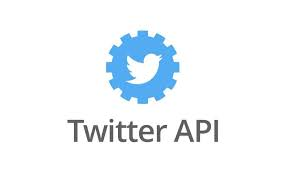

# これは何？？
Discordの多機能Botです。
# 機能は？
- LINEとのメッセージ連携
- ボイスチャンネルの入退室通知
- Web版VOICEVOXによる読み上げ機能
- カラオケ(動作不安定)
- ChatGPTへの質問(現在使用不可)
- Twitter,niocnicoの通知
- PostgreSQLを使用したLINEと入退室の管理

# ボイスチャンネルの入退室通知


#### 画面共有  


# LINEとのメッセージ共有
     

LINE側でメンションも可能です。

```
/チャンネル名#channel
    メッセージの先頭につけることで、送信先のチャンネルを指定できる。
@Discordのユーザー名#4桁の数字#member
    Discordのユーザーにメンションが可能。(ニックネームはNG)
@ロール名#role
    ロールでメンションが可能。
```
    

動画、スタンプも共有可能です。  
   

複数のサーバーにそれぞれLINEグループを作成し、それぞれにメッセージを共有させることもできます。
環境変数の項目で詳しく説明します。

# カラオケ
**注意:YouTube-dlを使用しています。**
```
/download
    YouTubeから音源をダウンロードします。
/start_record
    ダウンロードした音源を再生し、同時に録音を行います。
/rank_scoring
    音源と録音した音声を比較し、100点満点で採点します。
```


# Web版VoiceVoxのよる読み上げ機能
```
/zunda
	Botがボイスチャンネルに入室し、VoiceVoxでしゃべります。
/stop_zunda
	Botをボイスチャンネルから切断します。
```


# WebHookの投稿機能


# chatgtp(使用不可)
AIに質問できます。API更新前なので現在使用できるかわかりません。
```
/chatgtp
    AIに質問できます。
```


# Postgresqlを使用したカスタマイズ機能


# 使い方
本botはrailwayというサービスでのホストを想定しています。  
Dockerを使用しているので、簡単にホストできます。  
[](https://railway.app/new/template/JXslR5?referralCode=yFsnKR)  
railway側でLINEとDiscordBotをホストできるようにしています。  

## 使用するサービス  
以下のAPI、サービスを使用します。  
|[](https://gyazo.com/api/docs)|[](https://developers.line.biz/console/?status=success)|[](https://discord.com/developers/docs/resources/webhook)|[](https://developers.google.com/youtube/v3/getting-started?hl=ja)|[](https://voicevox.su-shiki.com/su-shikiapis/)|[](https://beta.openai.com/account/api-keys)|[](https://notify-bot.line.me/my/services/new)|[](https://developer.twitter.com/ja)|
|---|---|---|---|---|---|---|---|
|[GyazoAPI](https://gyazo.com/api/docs)|[LINE Developers](https://developers.line.biz/console/?status=success)|[Discord Webhook](https://discord.com/developers/docs/resources/webhook)|[YouTube Date API](https://developers.google.com/youtube/v3/getting-started?hl=ja)|[Web版Voicevox](https://voicevox.su-shiki.com/su-shikiapis/)|[OpenAI](https://beta.openai.com/account/api-keys)|[LINE Notify](https://notify-bot.line.me/my/services/new)|[Twitter OAuth1](https://developer.twitter.com/ja)|
|[参考(アーカイブ)](https://web.archive.org/web/20170724151212/http://yoshiyuki-hirano.hatenablog.jp/entry/2015/09/18/153155)|[参考](https://qiita.com/taka777n/items/c601421b871fd2b6a55f)|[参考](https://qiita.com/iroha71/items/b2a473898d6c9b4b4ae7)|[参考](https://qiita.com/koki_develop/items/4cd7de3898dae2c33f20)|  

LINEは画像や動画のファイルがバイナリデータとして渡され、一定時間で削除されてしまうのでGyazoとYouTubeにアップロードしてDiscordに送ります。  
YouTube APIは参考リンクをもとに、試しに動画をアップロードしておいてください。そうすると2つのjsonファイルが生成されるので控えておいてください。  
``` 控えておくjson
client_secret{clientのid}.json
upload_video.py-oauth2.json
```

# 環境変数について

DiscordBotのトークン以外にも、登録するものが大量にあります。
すべて```.env.sample```に記載されています。

- BOTS_NAME
```bash
DiscordのサーバーとLINEのグループを識別するための名前。
カンマ区切りで設定し、環境変数の名前として使用する。
例:(.env.sample参照)
    本BotをDiscordサーバー4つで稼働させているとする。
    名前:
        FIVE_SECOND
        FIVE_HOUR
        DAIGAKU
        TAKOYAKI
    このうち、LINEグループを作成しているのは
        FIVE_SECOND
        FIVE_HOUR
    の2つ。
    この場合、環境変数は
        BOTS_NAME=FIVE_SECOND,FIVE_HOUR
    と設定する。

    以降の環境変数は
        FIVE_SECOND_BOT_TOKEN
        FIVE_HOUR_NOTIFY_TOKEN
    と命名する。
```

- _BOT_TOKEN
```bash
・LINEBotのアクセストークン。
```

- _CHANNEL_SECRET 
```bash
・LINEBotのチャンネルシークレット。
```

- _GROUP_ID
```bach
・LINEのグループトークID。
```

- _GUILD_ID 
```bash
・DiscordのサーバーID。
```

- _CHANNEL_ID
```bash
・Discordにメッセージを送信するテキストチャンネルのID。雑談とかにおすすめ。
```

- _NOTIFY_TOKEN
```bash
・LINE Notifyのトークン。メッセージの送信に使用する。
```

- PORT=8080
```bash
・ポート番号。railwayでfastapiを立ち上げるのに必須（と公式で推奨されている）。
デフォルトで8080
```

- GYAZO_TOKEN 
```bash
・画像保存サービス「GYAZO」のAPIトークン。
LINEからDiscordへ画像を送信する際に使用。
```

DISCORD_CALLBACK_URL
```bash
・Discordログインの認証時に遷移するURL。
Developサイトにも同様に登録しておくこと。
```

DISCORD_CLIENT_ID
```bash
DiscordアプリのID。
BotのユーザIDと同じ。
```

DISCORD_CLIENT_SECRET
```bash
Discordのシークレットキー
認証時に使用する。Developサイトから発行すること。
```

DISCORD_SCOPE
```bash
Discordアプリに許可する権限一覧。
.env.sampleの権限通りにすること。
```

- DISCORD_BOT_TOKEN 
```bash
・DiscordBotのトークン。
```

- USER_LIMIT
```bash
・DiscordAPIを叩く際に取得するユーザーの上限。
値は何でもいいが大きいと処理が重くなる。
```

- YouTube Data API  
jsonの中身が機密情報の塊なので、一気に説明する。  
登録する環境変数は以下の通り7つ。
```bash
YOUTUBE_ACCESS_TOKEN
YOUTUBE_CLIENT_ID
YOUTUBE_CLIENT_SECRET
YOUTUBE_REFRESH_TOKEN
YOUTUBE_PROJECT_ID
YOUTUBE_TOKEN_EXPIRY
```
YouTube Data APIで生成された2つのjsonを以下に示す。  
os.environ[]となっている部分が、環境変数に該当する部分になる。

client_secret.json
``` client_secret.json
{
  "installed":
  	        {
  	            "client_id":os.environ["YOUTUBE_CLIENT_ID"],
  	            "project_id":os.environ["YOUTUBE_PROJECT_ID"],
  	            "auth_uri":"https://accounts.google.com/o/oauth2/auth",
  	            "token_uri":"https://oauth2.googleapis.com/token",
  	            "auth_provider_x509_cert_url":"https://www.googleapis.com/oauth2/v1/certs",
  				"client_secret":os.environ["YOUTUBE_CLIENT_SECRET"],
  				"redirect_uris":["http://localhost"]
  			}
}
```
upload_video.py-oauth2.json
``` upload_video.py-oauth2.json
{
	    "access_token":os.environ["YOUTUBE_ACCESS_TOKEN"],
	    "client_id":os.environ["YOUTUBE_CLIENT_ID"],
	    "client_secret":os.environ["YOUTUBE_CLIENT_SECRET"],
	    "refresh_token":os.environ["YOUTUBE_REFRESH_TOKEN"],
	    "token_expiry": os.environ["YOUTUBE_TOKEN_EXPIRY"], 
	    "token_uri": "https://oauth2.googleapis.com/token",
	    "user_agent": None,
	    "revoke_uri": "https://oauth2.googleapis.com/revoke", 
	    "id_token": None, 
	    "id_token_jwt": None, 
	    "token_response": {
	        "access_token":os.environ["YOUTUBE_ACCESS_TOKEN"],
	        "expires_in": 3599, 
	        "scope": "https://www.googleapis.com/auth/youtube.upload", 
	        "token_type": "Bearer"
	    },
	    "scopes": ["https://www.googleapis.com/auth/youtube.upload"], 
	    "token_info_uri": "https://oauth2.googleapis.com/tokeninfo", 
	    "invalid": False, 
	    "_class": "OAuth2Credentials", 
	    "_module": "oauth2client.client"
}
```
- TWITTER_BEARER_TOKEN
```
・TwitterのBearerトークン。
```

- VOICEVOX_KEY
```bash
・Web版VOICEVOXのAPIキー。
```

- CHATGPT
```bash
・ChatGPTのAPIキー。
```

- PGDATABASE
```bash
・PostgreSQLのデータベース名
```

- PGHOST
```bash
・データベースのホスト名
```

- PGPASSWORD
```bash
・データベースのパスワード
```

- PGPORT
```bash
・データベースのポート番号
```

- PGUSER
```bash
・データベースのユーザー名
```